# Site

Projeto Opensource que visa melhorar o match entre os profissionais Juniors e Empresas.


## Instalação

Clone o projeto.

```bash
  git clone https://github.com/SouJunior/Site
```

Entre no diretório do projeto

```bash
  cd Site
```

Instale as dependências

```bash
  npm install
```

## Rodando localmente

Inicie o servidor

```bash
  npm run dev
```

## Usado por

Esse projeto é usado pela [SouJunior](https://github.com/SouJunior).

## Tecnologias utilizadas

       

## DevOps

```mermaid
sequenceDiagram
    actor Dev as Desenvolvedores
    participant Git as GitHub
    participant Net as Netlify

    Note over Dev,Net: Fluxo de Deploy com Preview

    Dev->>Git: Abre Pull Request (PR) para main
    Git->>Net: Novo Evento: PR criada
    Net-->>Git: Deploy Preview criado
    
    Note over Dev,Net: Loop de desenvolvimento
    
    Dev->>Git: Aprova e mergeia PR para main
    Git->>Net: Novo Evento: Branch main atualizada
    Net-->>Git: Deploy de Produção atualizado
```



## Autor(es) 🙎🏻‍♂️

- Anderson Nunes | [GitHub](https://https://github.com/Dande94) - [LinkedIn](https://www.linkedin.com/in/anderson-nunes-000541225/)
- Ana Santos | [GitHub](https://github.com/SilviaLTeixeira) - [LinkedIn](https://www.linkedin.com/in/ana-saantos/)
- Edvaldo Cabral | [GitHub](https://github.com/edcabralc) - [LinkedIn](https://www.linkedin.com/in/edcabralc/)
- Michelle Porto | [GitHub](https://github.com/michelleporto/michelleporto) - [LinkedIn](https://www.linkedin.com/in/michelle-porto-ribeiro/)

## Feedback

Se você tiver algum feedback, por favor nos deixe saber por meio do nosso [Discord](https://discord.gg/naTaHgZZpz).
